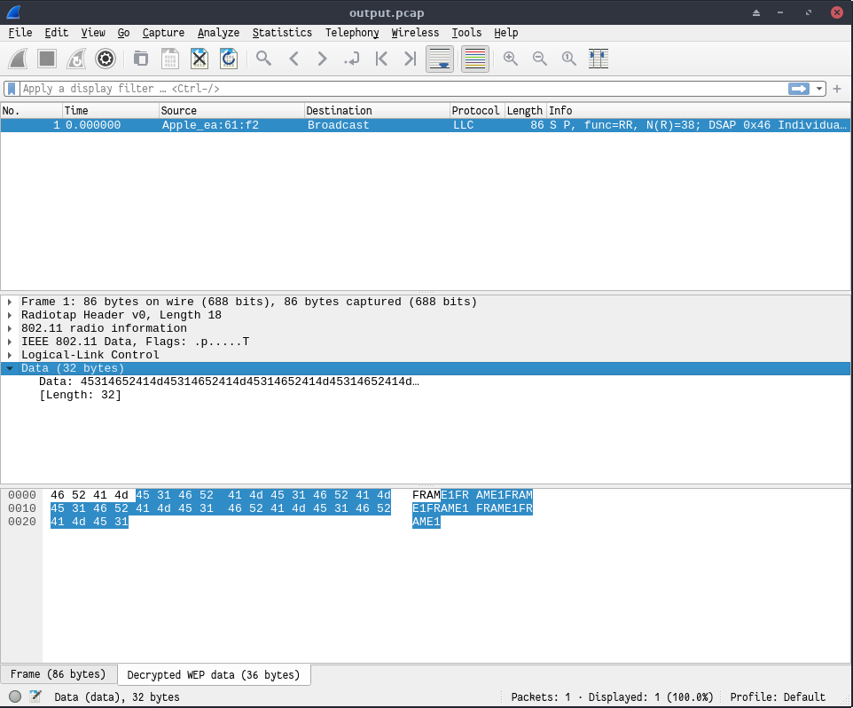
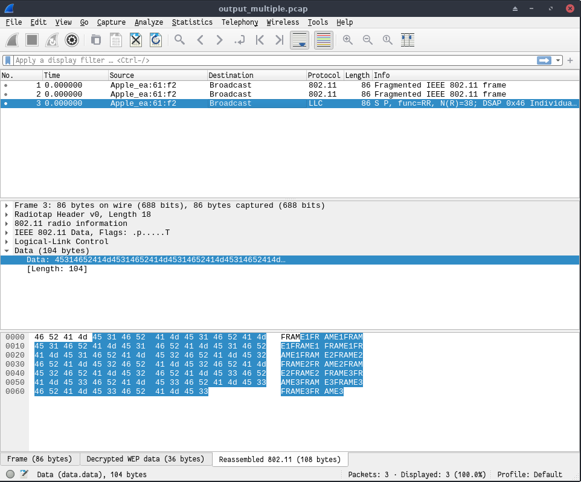

# SWI - Laboratoire 3 - WEP

## Auteurs : Edin Mujkanovic et Daniel Oliveira Paiva

### 1. Informations

Dans ce laboratoire, il nous était demandé de faire un chiffrement manuel "simple" (exercice 2) et un chiffrement manuel fragmenté (exercice 3). Ci-dessous, la structure du rendu :

- Chiffrement manuel "simple" : 
  - Le contenu se trouve dans le dossier `scripts/encrypt_simple` .
  - Le script s'appelle `manual-encrypt.py`
  - Le fichier généré s'appelle `output.pcap`
- Chiffrement manuel fragmenté : 
  - Le contenu se trouve dans le dossier `scripts/encrypt_multiple`.
  - Le script s'appelle `manual-encrypt-multiple-packets.py`
  - Le fichier généré s'appelle `output_multiple.pcap`

### 2. Chiffrement manuel "simple"

Ci-dessous, une capture d'écran présentant le résultat de notre trame importée et déchifrée dans Wireshark pour le chiffrement manuel simple : 

### 3. Chiffrement manuel fragmenté

Ci-dessous, une capture d'écran présentant le résultat de notre fichier importé et déchifré dans Wireshark pour le chiffrement manuel fragmenté :

 